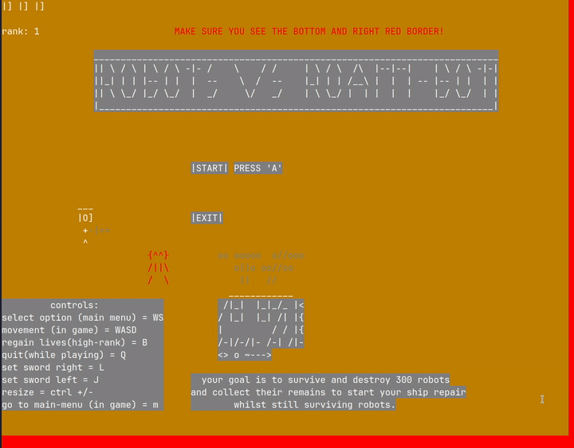

# Robots vs Roam-Bot
An ascii survival game made for an itch.io Game Jam.

# Controls
Move Right: D \
Move Left: A \
Move Down: S \
Move Up: S \
Sword Right: L \
Sword Left: J \
Reset Lives based on rank: B \
Quit: Q \
Main Menu: M \
Menu Navigate up: W \
Menu Navigate down: S

# Build Instructions
You will need to have gcc or clang, GNU make, pkg-config and ncurses installed on your system.

## GCC Build and run
```
make release
make run
```

## Clang Build and run
```
CC=clang make release
make run
```
